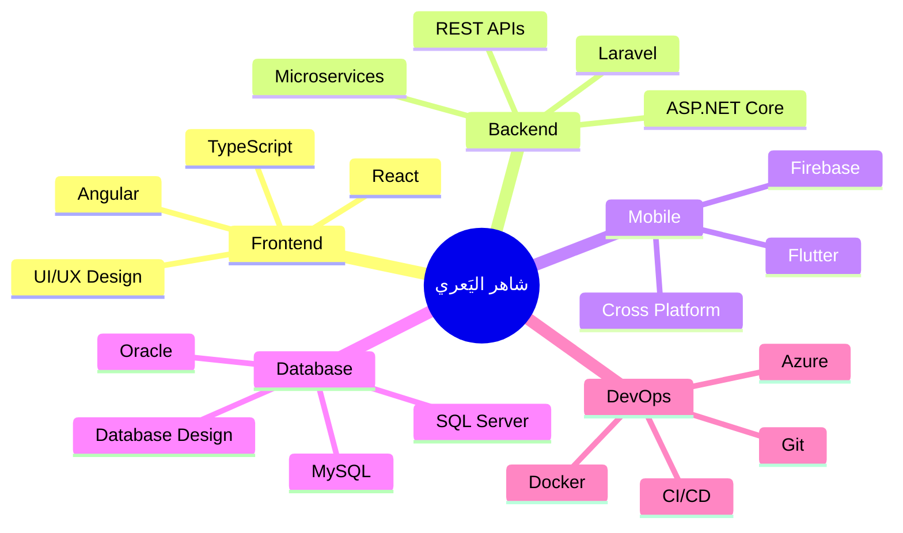
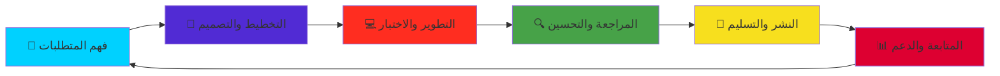

<div align="center">

<!-- Header with animated typing effect -->


</div>

---

<div align="center">

### 🌟 مطور متكامل | مبتكر حلول تقنية | طالب تقنية معلومات 🌟

[](https://programershaher.github.io/)
[](https://github.com/ProgramerShaher)
[](https://www.linkedin.com/in/شاهر-خالد-اليعري-27606a385)
[](mailto:alyaarishaher@gmail.com)

</div>

---


### 👨‍💻 نبذة عني

```typescript
const shaherAlyaari = {
    name: "شاهر خالد اليَعري",
    title: "Full Stack Developer",
    location: "Yemen 🇾🇪",
    education: "جامعة 21 سبتمبر - تقنية المعلومات",
    graduationYear: 2024,
    
    expertise: {
        backend: ["C#", "ASP.NET Core", "PHP", "Laravel"],
        frontend: ["Angular", "React", "TypeScript", "JavaScript"],
        mobile: ["Flutter", "Dart"],
        databases: ["SQL Server", "MySQL", "Oracle"],
        tools: ["Git", "Docker", "Postman", "Azure DevOps"]
    },
    
    specialization: [
        "🏥 Hospital Management Systems",
        "🏫 School Management Systems", 
        "💊 Pharmacy Management",
        "⚖️ Legal Office Management",
        "🛒 E-commerce Solutions"
    ],
    
    currentFocus: "Building scalable enterprise applications",
    availableFor: "Freelance Projects & Full-time Opportunities",
    
    motto: "Clean Code | Best Practices | Innovation"
};
```

<br clear="right"/>

---

## 🛠️ مجموعة التقنيات والأدوات

<div align="center">

### 💻 لغات البرمجة


### 🎨 Frontend Development


### ⚙️ Backend Development


### 📱 Mobile Development


### 🗄️ قواعد البيانات


### 🔧 الأدوات والتقنيات


</div>

---

## 📊 إحصائيات GitHub

<div align="center">


</div>

---

## 🏆 إنجازات ومهارات

<div align="center">


</div>

### 📈 مستويات الإتقان

<div align="center">

| المجال | المهارة | المستوى | الخبرة |
|:---:|:---:|:---:|:---:|
| 🎨 **Frontend** | Angular |  | 2.5 سنة |
| 🎨 **Frontend** | React |  | 1.5 سنة |
| ⚙️ **Backend** | ASP.NET Core |  | 3 سنوات |
| ⚙️ **Backend** | Laravel |  | 2 سنة |
| 📱 **Mobile** | Flutter |  | 2 سنة |
| 🗄️ **Database** | SQL Server |  | 3 سنوات |
| 💻 **Language** | C# |  | 3 سنوات |
| 📊 **DevOps** | Git & Docker |  | 2 سنة |

</div>

---

## 🚀 المشاريع البارزة

<div align="center">

<table>
<tr>
<td width="50%">

### 💊 نظام إدارة الصيدلية
**نظام ذكي متكامل لإدارة الصيدليات**

[](https://github.com/ProgramerShaher)

**التقنيات المستخدمة:**
- 
- 
- 

**المميزات:**
✅ إدارة المخزون الذكية  
✅ نظام الفواتير والمبيعات  
✅ تقارير تحليلية متقدمة  
✅ واجهة مستخدم عصرية

</td>
<td width="50%">

### ⚖️ نظام إدارة المكاتب القانونية
**منصة ويب وموبايل شاملة**

[](https://github.com/ProgramerShaher)

**التقنيات المستخدمة:**
- 
- 
- 

**المميزات:**
✅ إدارة القضايا والمواعيد  
✅ تطبيق موبايل متقدم  
✅ إشعارات فورية  
✅ أرشفة ذكية للمستندات

</td>
</tr>

<tr>
<td width="50%">

### 🛒 متجر القهوة الإلكتروني
**منصة تجارة إلكترونية متكاملة**

[](https://github.com/ProgramerShaher)

**التقنيات المستخدمة:**
- 
- 
- 

**المميزات:**
✅ عربة تسوق ذكية  
✅ نظام دفع آمن  
✅ لوحة تحكم إدارية  
✅ تجربة مستخدم سلسة

</td>
<td width="50%">

### 🏥 نظام إدارة المستشفيات
**حل شامل للمؤسسات الطبية**

[](https://github.com/ProgramerShaher)

**التقنيات المستخدمة:**
- 
- 
- 

**المميزات:**
✅ إدارة المرضى والمواعيد  
✅ السجلات الطبية الإلكترونية  
✅ نظام الصيدلية المتكامل  
✅ تقارير طبية شاملة

</td>
</tr>
</table>

[](https://github.com/ProgramerShaher?tab=repositories)

</div>

---

## 💼 الخبرات والمهارات المتقدمة

<div align="center">

### 🎯 مجالات التخصص



</div>

### 🏗️ الأنماط المعمارية

<div align="center">

| النمط المعماري | الوصف | مستوى الإتقان |
|:---:|:---:|:---:|
| 🏛️ **Clean Architecture** | فصل طبقات التطبيق وتنظيمها |  |
| 📋 **MVC Pattern** | نمط Model-View-Controller |  |
| 🔄 **Repository Pattern** | فصل منطق الوصول للبيانات |  |
| ⚡ **CQRS** | فصل عمليات القراءة والكتابة |  |
| 🎯 **Domain-Driven Design** | التصميم المعتمد على النطاق |  |
| 🔌 **Microservices** | بناء الخدمات الصغيرة المستقلة |  |

</div>

---

## 🎓 التعليم والشهادات

<div align="center">

<table>
<tr>
<td width="50%">

### 🎓 التعليم الأكاديمي


**جامعة 21 سبتمبر**  
📚 بكالوريوس تقنية المعلومات  
📅 2021 - 2024  
🏆 معدل تراكمي ممتاز  
🎯 السنة الأخيرة

**التخصصات:**
- هندسة البرمجيات
- تطوير الويب
- قواعد البيانات
- هندسة الأنظمة

</td>
<td width="50%">

### 📜 الشهادات التقنية


🏅 **ASP.NET Core المتقدمة**  
🏅 **دورة Flutter الشاملة**  
🏅 **Angular الاحترافية**  
🏅 **Database Design & SQL**  
🏅 **Clean Code Principles**  
🏅 **Git & Version Control**  
🏅 **Docker Essentials**  
🏅 **API Development**

</td>
</tr>
</table>

</div>

---

## 🌟 الإنجازات والجوائز

<div align="center">

| 🏆 الإنجاز | 📅 السنة | 🎯 التفاصيل |
|:---:|:---:|:---|
| 🥇 **أفضل مشروع تخرج** | 2024 | نظام إدارة الصيدلية الذكي - المركز الأول |
| ⭐ **مطور الشهر** | 2023 | 100+ مساهمة في مشاريع مفتوحة المصدر |
| 🎖️ **شهادة التميز** | 2023 | تميز في ASP.NET Core Development |
| 🏅 **هاكاثون الجامعة** | 2022 | المركز الأول - تطوير تطبيقات الويب |
| 💯 **تقييم المشاريع** | 2024 | متوسط 98% في جميع المشاريع الدراسية |
| 🌐 **مشاريع حرة ناجحة** | 2022-2024 | 15+ مشروع منجز بنجاح |

</div>

---

## 📞 تواصل معي

<div align="center">


### 🌐 قنوات التواصل

<table>
<tr>
<td align="center" width="25%">
<a href="https://programershaher.github.io/">

<br/>
<strong>الموقع الشخصي</strong>
<br/>

</a>
</td>
<td align="center" width="25%">
<a href="https://github.com/ProgramerShaher">

<br/>
<strong>GitHub</strong>
<br/>

</a>
</td>
<td align="center" width="25%">
<a href="https://www.linkedin.com/in/شاهر-خالد-اليعري-27606a385">

<br/>
<strong>LinkedIn</strong>
<br/>

</a>
</td>
<td align="center" width="25%">
<a href="mailto:alyaarishaher@gmail.com">

<br/>
<strong>Email</strong>
<br/>

</a>
</td>
</tr>
<tr>
<td align="center" width="25%">
<a href="https://wa.me/+967779007753">

<br/>
<strong>WhatsApp</strong>
<br/>

</a>
</td>
<td align="center" width="25%">
<a href="https://t.me/Engineering_Shaher_ALyaari">

<br/>
<strong>Telegram</strong>
<br/>

</a>
</td>
<td align="center" width="25%">
<a href="https://www.facebook.com/shahr.khald.aly.ry.2025">

<br/>
<strong>Facebook</strong>
<br/>

</a>
</td>
<td align="center" width="25%">
<a href="https://www.instagram.com/shhrlyry">

<br/>
<strong>Instagram</strong>
<br/>

</a>
</td>
</tr>
</table>

### 📧 معلومات الاتصال السريع

```javascript
const contactInfo = {
    name: "شاهر خالد اليَعري",
    email: "alyaarishaher@gmail.com",
    phone: "+967779007753",
    location: "اليمن 🇾🇪",
    website: "https://programershaher.github.io/",
    
    availability: {
        freelance: "✅ متاح",
        fullTime: "✅ متاح",
        partTime: "✅ متاح",
        consultation: "✅ متاح"
    },
    
    preferredContactMethod: ["WhatsApp", "Email", "Telegram"],
    responseTime: "خلال 24 ساعة"
};
```

</div>

---

## 💭 فلسفة التطوير

<div align="center">


### 🎯 مبادئي في البرمجة

<table>
<tr>
<td width="33%" align="center">

### 🎨 **جودة الكود**
```
Clean Code
Best Practices
SOLID Principles
Code Reviews
```
*"الكود النظيف يتحدث عن نفسه"*

</td>
<td width="33%" align="center">

### 🚀 **الابتكار المستمر**
```
Always Learning
Stay Updated
Embrace Change
Think Creative
```
*"التعلم رحلة لا تنتهي"*

</td>
<td width="33%" align="center">

### 🤝 **التعاون والمشاركة**
```
Team Player
Open Source
Knowledge Sharing
Community Driven
```
*"معاً نصنع الفرق"*

</td>
</tr>
</table>

### 📋 منهجية العمل



</div>

---

## 📈 نشاطي على GitHub

<div align="center">

### 🔥 سلسلة المساهمات


### 📊 إحصائيات تفصيلية

<table>
<tr>
<td>

</td>
<td>

</td>
</tr>
</table>

### 🏆 ملخص الإنجازات


</div>

---

## 🎮 الاهتمامات والهوايات

<div align="center">

<table>
<tr>
<td width="25%" align="center">

<br/>
<strong>البرمجة</strong>
<br/>

</td>
<td width="25%" align="center">

<br/>
<strong>التصميم</strong>
<br/>

</td>
<td width="25%" align="center">

<br/>
<strong>القراءة</strong>
<br/>

</td>
<td width="25%" align="center">

<br/>
<strong>الرياضة</strong>
<br/>

</td>
</tr>
</table>

### 📚 مجالات الاهتمام

![Software 
