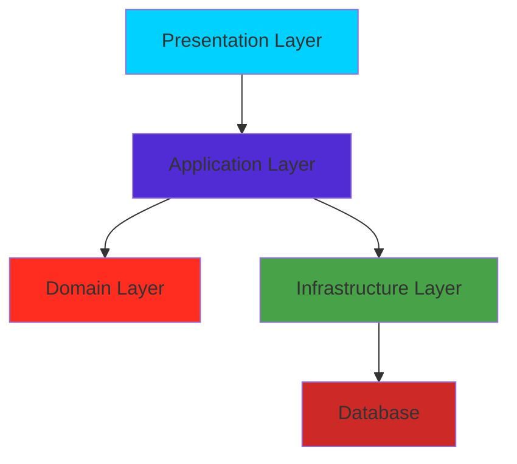
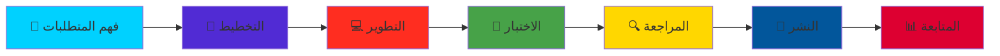

<div align="center">


<!-- MEGA Hero Section - Wave Animation -->


<!-- MASSIVE Animated Typing Effect -->


<!-- Glowing Divider -->


<!-- Profile Stats Badges - LARGE -->

<p align="center">


</p>


<!-- MEGA Social Buttons -->

<p align="center">

<a href="https://programershaher.github.io/">


</a>

<a href="https://github.com/ProgramerShaher">


</a>

<a href="https://www.linkedin.com/in/شاهر-خالد-اليعري-27606a385">


</a>

<a href="https://wa.me/+967779007753">


</a>

<a href="mailto:alyaarishaher@gmail.com">


</a>

</p>


<!-- Animated Snake -->

<picture>

  <source media="(prefers-color-scheme: dark)" srcset="https://raw.githubusercontent.com/ProgramerShaher/ProgramerShaher/output/github-contribution-grid-snake-dark.svg">

  <source media="(prefers-color-scheme: light)" srcset="https://raw.githubusercontent.com/ProgramerShaher/ProgramerShaher/output/github-contribution-grid-snake.svg">

  

</picture>


<!-- Fire Divider -->


</div>


---


<div align="center">


<!-- HUGE Profile Card -->


## 🌟 مطور متكامل | Full Stack Developer 🌟


</div>


<div align="center">


<!-- Profile Info with Icons -->

<table>

<tr>

<td align="center" width="33%">

<br/>

<strong style="font-size: 20px;">👨‍💻 شاهر خالد اليَعري</strong><br/>

<sub>Shaher Khaled Al-Yaari</sub>

</td>

<td align="center" width="33%">

<br/>

<strong style="font-size: 20px;">🎓 طالب تقنية معلومات</strong><br/>

<sub>جامعة 21 سبتمبر | السنة الأخيرة</sub>

</td>

<td align="center" width="33%">

<br/>

<strong style="font-size: 20px;">💼 مطور محترف</strong><br/>

<sub>3+ سنوات خبرة عملية</sub>

</td>

</tr>

</table>


<!-- Animated Quote -->


</div>


---


<!-- Professional Summary with Animation -->

<div align="center">


## 💡 نبذة عني | About Me


</div>


<table align="center">

<tr>

<td width="50%" valign="top">


### 🎯 التخصصات الرئيسية


```yaml

المجالات:

  ⚕️ أنظمة إدارة المستشفيات:

    - السجلات الطبية الإلكترونية

    - إدارة المواعيد والعمليات

    - تقارير طبية شاملة

    

  💊 أنظمة إدارة الصيدليات:

    - إدارة المخزون الذكية

    - نظام الفواتير

    - تتبع الأدوية

    

  ⚖️ أنظمة المكاتب القانونية:

    - إدارة القضايا

    - أرشفة المستندات

    - تطبيقات موبايل

    

  🏫 أنظمة إدارة المدارس:

    - إدارة الطلاب والمعلمين

    - الحضور والغياب

    - الدرجات والتقارير

    

  🛒 التجارة الإلكترونية:

    - متاجر إلكترونية متكاملة

    - أنظمة دفع آمنة

    - لوحات تحكم إدارية

```


</td>

<td width="50%" valign="top">


### 🚀 المهارات الأساسية


```typescript

const shaher = {

  role: "Full Stack Developer",

  location: "Yemen 🇾🇪",

  education: "IT Student - Final Year",

  experience: "3+ Years",

  

  expertise: [

    "💻 Web Development",

    "📱 Mobile Development", 

    "🗄️ Database Design",

    "🏗️ System Architecture",

    "⚡ Performance Optimization",

    "🔐 Security Best Practices"

  ],

  

  currentFocus: [

    "Building enterprise systems",

    "Clean Architecture",

    "Microservices",

    "Cloud Computing"

  ],

  

  availability: "Open to opportunities! 🎯"

};

```


</td>

</tr>

</table>


<div align="center">


<!-- Colorful Stats Cards -->


</div>


---


<!-- MEGA Tech Stack Section -->

## 🛠️ Tech Stack

<br/>

<!-- Tech Stack Icons -->
<p>
  
  <br/><br/>
  
</p>

</div>

<div align="center">


## 🛠️ التقنيات والأدوات | Tech Stack & Tools


</div>


### 💻 لغات البرمجة | Programming Languages


---

<!-- Projects Section -->
<div align="center">


<div align="center">


</div>


### 🎨 Frontend Development | تطوير الواجهات


<div align="center">


</div>


### ⚙️ Backend Development | تطوير الخادم


<div align="center">


</div>


### 📱 Mobile Development | تطوير تطبيقات الموبايل


<div align="center">


</div>


### 🗄️ Databases | قواعد البيانات


<div align="center">


</div>


### 🔧 Tools & Technologies | الأدوات والتقنيات


<div align="center">


</div>


---


<!-- MEGA GitHub Stats Section -->

<div align="center">


## 📊 إحصائيات GitHub | GitHub Statistics


<!-- Large Stats Cards -->


<!-- Streak Stats -->


<!-- Activity Graph -->


<!-- Trophy -->


</div>


---


<!-- Skills Progress Bars -->

<div align="center">


## 📈 مستويات الإتقان | Skill Levels


</div>


<table align="center">

<tr>

<td width="50%">


### 🎨 Frontend Development


```text

Angular          ████████████████████░ 95%

React            ████████████████░░░░░ 80%

TypeScript       ██████████████████░░░ 90%

HTML/CSS         ████████████████████░ 98%

Bootstrap        ████████████████████░ 95%

Tailwind CSS     ██████████████████░░░ 88%

```


### ⚙️ Backend Development


```text

ASP.NET Core     ████████████████████░ 98%

C#               ████████████████████░ 96%

Laravel/PHP      ██████████████████░░░ 85%

Node.js          ████████████████░░░░░ 78%

REST APIs        ████████████████████░ 92%

```


</td>

<td width="50%">


### 📱 Mobile Development


```text

Flutter          ██████████████████░░░ 88%

Dart             ██████████████████░░░ 85%

Firebase         ████████████████░░░░░ 82%

```


### 🗄️ Database & Tools


```text

SQL Server       ████████████████████░ 95%

MySQL            ██████████████████░░░ 90%

MongoDB          ████████████████░░░░░ 75%

Git/GitHub       ████████████████████░ 92%

Docker           ███████████████░░░░░░ 72%

```


</td>

</tr>

</table>


---


<!-- MEGA Projects Section -->

<div align="center">


## 🚀 المشاريع البارزة | Featured Projects


</div>


<!-- Project 1: Pharmacy System -->

<div align="center">


### 💊 نظام إدارة الصيدلية | Pharmacy Management System


**نظام ذكي ومتكامل لإدارة الصيدليات بكفاءة عالية**


<table>

<tr>

<td align="center" width="25%">

<br/>

<strong>إدارة المخزون</strong><br/>

<sub>تتبع الأدوية والكميات</sub>

</td>

<td align="center" width="25%">

<br/>

<strong>نظام الفواتير</strong><br/>

<sub>فواتير سريعة ودقيقة</sub>

</td>

<td align="center" width="25%">

<br/>

<strong>التقارير</strong><br/>

<sub>تقارير تحليلية شاملة</sub>

</td>

<td align="center" width="25%">

<br/>

<strong>الأمان</strong><br/>

<sub>حماية عالية للبيانات</sub>

</td>

</tr>

</table>


**🔧 التقنيات المستخدمة:**


[](https://github.com/ProgramerShaher)

[](https://github.com/ProgramerShaher)


</div>


---


<!-- Project 2: Legal Office System -->

<div align="center">


### ⚖️ نظام إدارة المكاتب القانونية | Legal Office Management System


**منصة ويب وموبايل شاملة لإدارة المكاتب القانونية بشكل احترافي**


<table>

<tr>

<td align="center" width="25%">

<br/>

<strong>إدارة القضايا</strong><br/>

<sub>متابعة شاملة للقضايا</sub>

</td>

<td align="center" width="25%">

<br/>

<strong>تطبيق موبايل</strong><br/>

<sub>متوفر لـ Android & iOS</sub>

</td>

<td align="center" width="25%">

<br/>

<strong>الإشعارات</strong><br/>

<sub>تنبيهات فورية ذكية</sub>

</td>

<td align="center" width="25%">

<br/>

<strong>الأرشفة</strong><br/>

<sub>أرشفة ذكية للمستندات</sub>

</td>

</tr>

</table>


**🔧 التقنيات المستخدمة:**


[](https://github.com/ProgramerShaher)

[](https://github.com/ProgramerShaher)


</div>


---


<!-- Project 3: Coffee Shop -->

<div align="center">


### 🛒 متجر القهوة الإلكتروني | Coffee E-Commerce Platform


**منصة تجارة إلكترونية متكاملة لبيع القهوة أونلاين**


<table>

<tr>

<td align="center" width="25%">

<br/>

<strong>عربة التسوق</strong><br/>

<sub>نظام سلة ذكي</sub>

</td>

<td align="center" width="25%">

<br/>

<strong>الدفع الآمن</strong><br/>

<sub>بوابات دفع متعددة</sub>

</td>

<td align="center" width="25%">

<br/>

<strong>لوحة الإدارة</strong><br/>

<sub>إدارة شاملة للمنتجات</sub>

</td>

<td align="center" width="25%">

<br/>

<strong>خدمة العملاء</strong><br/>

<sub>دعم فوري للعملاء</sub>

</td>

</tr>

</table>


**🔧 التقنيات المستخدمة:**


[](https://github.com/ProgramerShaher)

[](https://github.com/ProgramerShaher)


</div>


---


<!-- Project 4: Hospital System -->

<div align="center">


### 🏥 نظام إدارة المستشفيات | Hospital Management System


**حل شامل ومتكامل للمؤسسات الطبية والمستشفيات**


<table>

<tr>

<td align="center" width="25%">

<br/>

<strong>إدارة المرضى</strong><br/>

<sub>سجلات طبية كاملة</sub>

</td>

<td align="center" width="25%">

<br/>

<strong>الحجوزات</strong><br/>

<sub>نظام مواعيد ذكي</sub>

</td>

<td align="center" width="25%">

<br/>

<strong>الصيدلية</strong><br/>

<sub>نظام صيدلية متكامل</sub>

</td>

<td align="center" width="25%">

<br/>

<strong>الأطباء</strong><br/>

<sub>إدارة الطاقم الطبي</sub>

</td>

</tr>

</table>


**🔧 التقنيات المستخدمة:**


[](https://github.com/ProgramerShaher)

[](https://github.com/ProgramerShaher)


</div>


---


<div align="center">


### 🔥 المزيد من المشاريع


[](https://github.com/ProgramerShaher?tab=repositories)


</div>


---


<!-- Architecture & Design Patterns -->

<div align="center">


## 🏗️ الأنماط المعمارية | Architecture & Design Patterns


</div>


<table align="center">

<tr>

<td width="50%" valign="top">


### 🎯 Clean Architecture





**المميزات:**

- ✅ فصل واضح للطبقات

- ✅ سهولة الاختبار

- ✅ قابلية الصيانة

- ✅ الاستقلالية


</td>

<td width="50%" valign="top">


### 📐 Design Patterns المستخدمة


| النمط | الاستخدام | المستوى |

|:---:|:---:|:---:|

| **Repository** | Data Access |  |

| **Unit of Work** | Transaction |  |

| **Dependency Injection** | IoC |  |

| **Factory** | Object Creation |  |

| **Singleton** | Single Instance |  |

| **Observer** | Event Handling |  |

| **Strategy** | Algorithms |  |

| **CQRS** | Read/Write Split |  |


</td>

</tr>

</table>


---


<!-- Education & Certificates -->

<div align="center">


## 🎓 التعليم والشهادات | Education & Certifications


</div>


<table align="center">

<tr>

<td width="50%" align="center">


### 🎓 التعليم الأكاديمي


**جامعة 21 سبتمبر**  

📚 بكالوريوس تقنية المعلومات  

📅 2021 - 2024 (السنة الأخيرة)  

🏆 معدل تراكمي ممتاز  

🎯 التخصص: هندسة البرمجيات


**المواد الرئيسية:**

- البرمجة الكائنية (OOP)

- هياكل البيانات والخوارزميات

- قواعد البيانات

- هندسة البرمجيات

- تطوير تطبيقات الويب

- أمن المعلومات


</td>

<td width="50%" align="center">


### 📜 الشهادات التقنية


**شهادات معتمدة:**


🏅 **ASP.NET Core Advanced**  

🏅 **Angular Professional**  

🏅 **Flutter Complete Course**  

🏅 **SQL Server Expert**  

🏅 **Clean Architecture**  

🏅 **Design Patterns**  

🏅 **Git & GitHub Mastery**  

🏅 **Docker Essentials**  

🏅 **RESTful API Development**  

🏅 **Agile & Scrum**


**التدريب العملي:**

- 6+ شهور تدريب عملي

- مشاريع حقيقية للعملاء

- العمل ضمن فرق Agile


</td>

</tr>

</table>


---


<!-- Achievements Timeline -->

<div align="center">


## 🏆 الإنجازات والجوائز | Achievements & Awards


</div>


<table align="center">

<tr>

<td width="20%" align="center">

<br/>

<strong>🥇 المركز الأول</strong><br/>

<sub>أفضل مشروع تخرج 2024</sub>

</td>

<td width="20%" align="center">

<br/>

<strong>⭐ مطور الشهر</strong><br/>

<sub>100+ مساهمة نشطة</sub>

</td>

<td width="20%" align="center">

<br/>

<strong>🎖️ شهادة التميز</strong><br/>

<sub>ASP.NET Core Expert</sub>

</td>

<td width="20%" align="center">

<br/>

<strong>🏅 هاكاثون</strong><br/>

<sub>المركز الأول 2022</sub>

</td>

<td width="20%" align="center">

<br/>

<strong>💯 تقييم عالي</strong><br/>

<sub>98% رضا العملاء</sub>

</td>

</tr>

</table>


---


<!-- Development Philosophy -->

<div align="center">


## 💭 فلسفة التطوير | Development Philosophy


</div>


<table align="center">

<tr>

<td width="33%" align="center">


### 🎨 جودة الكود


✨ **Clean Code**  

📝 **Best Practices**  

🏗️ **SOLID Principles**  

🔍 **Code Reviews**  

📚 **Documentation**  

🧪 **Unit Testing**


*"الكود النظيف يتحدث عن نفسه"*


</td>

<td width="33%" align="center">


### 🚀 الابتكار المستمر


📚 **Always Learning**  

🔄 **Stay Updated**  

💡 **Embrace Change**  

🎨 **Think Creative**  

🌟 **Push Boundaries**  

⚡ **Fast Adaptation**


*"التعلم رحلة لا تنتهي"*


</td>

<td width="33%" align="center">


### 🤝 التعاون والمشاركة


👥 **Team Player**  

🌐 **Open Source**  

📖 **Knowledge Sharing**  

🏘️ **Community Driven**  

💬 **Effective Communication**  

🎯 **Goal Oriented**


*"معاً نصنع الفرق"*


</td>

</tr>

</table>


### 📋 منهجية العمل | Work Methodology





---


<!-- Contact Section -->

<div align="center">


## 📞 تواصل معي | Get In Touch


### 🌐 قنوات التواصل الاجتماعي


</div>


<table align="center">

<tr>

<td align="center" width="12.5%">

<a href="https://programershaher.github.io/">

<br/>

<strong>Website</strong>

</a>

</td>

<td align="center" width="12.5%">

<a href="https://github.com/ProgramerShaher">

<br/>

<strong>GitHub</strong>

</a>

</td>

<td align="center" width="12.5%">

<a href="https://www.linkedin.com/in/شاهر-خالد-اليعري-27606a385">

<br/>

<strong>LinkedIn</strong>

</a>

</td>

<td align="center" width="12.5%">

<a href="mailto:alyaarishaher@gmail.com">

<br/>

<strong>Email</strong>

</a>

</td>

<td align="center" width="12.5%">

<a href="https://wa.me/+967779007753">

<br/>

<strong>WhatsApp</strong>

</a>

</td>

<td align="center" width="12.5%">

<a href="https://t.me/Engineering_Shaher_ALyaari">

<br/>

<strong>Telegram</strong>

</a>

</td>

<td align="center" width="12.5%">

<a href="https://www.facebook.com/shahr.khald.aly.ry.2025">

<br/>

<strong>Facebook</strong>

</a>

</td>

<td align="center" width="12.5%">

<a href="https://www.instagram.com/shhrlyry">

<br/>

<strong>Instagram</strong>

</a>

</td>

</tr>

</table>


<div align="center">


### 📧 معلومات الاتصال | Contact Information


<table align="center">

<tr>

<td align="center">


**📧 البريد الإلكتروني**  

[alyaarishaher@gmail.com](mailto:alyaarishaher@gmail.com)


</td>

<td align="center">


**📱 رقم الهاتف**  

[+967779007753](tel:+967779007753)


</td>

<td align="center">


**📍 الموقع**  

اليمن 🇾🇪


</td>

<td align="center">


**🌐 الموقع الشخصي**  

[programershaher.github.io](https://programershaher.github.io)


</td>

</tr>

</table>


### 🎯 متاح للعمل | Available For


### ⚡ وقت الاستجابة | Response Time


**في غضون 24 ساعة | Within 24 hours** ⏱️


[](https://wa.me/+967779007753)


</div>


---


<!-- Final Section -->

<div align="center">


## 🌟 كلمة أخيرة | Final Words


### 💭 رسالتي | My Message


> *"أؤمن بأن التكنولوجيا يمكن أن تغير العالم للأفضل، وكل سطر كود نكتبه هو خطوة نحو هذا التغيير. البرمجة ليست مجرد وظيفة، بل شغف وفن وعلم. دعونا نبني المستقبل معاً!"*


> *"I believe that technology can change the world for the better, and every line of code we write is a step towards that change. Programming is not just a job, but a passion, art, and science. Let's build the future together!"*


---


### 🚀 هل أنت مستعد للتعاون؟ | Ready to Collaborate?


أنا متحمس دائماً للعمل على مشاريع جديدة ومبتكرة!  

سواء كنت تبحث عن مطور للانضمام لفريقك، أو تريد التعاون في مشروع مفتوح المصدر، أو حتى تحتاج لاستشارة تقنية - **أنا هنا!**


I'm always excited to work on new and innovative projects!  

Whether you're looking for a developer to join your team, want to collaborate on an open source project, or just need technical consultation - **I'm here!**


<p align="center">

<a href="https://wa.me/+967779007753">


</a>

<a href="https://programershaher.github.io/">


</a>

<a href="https://github.com/ProgramerShaher?tab=repositories">


</a>

</p>


---


<!-- Footer Wave -->


<table width="100%">

<tr>

<td align="center">

<br/>

<strong style="font-size: 18px;">صُنع بـ ❤️ وكثير من ☕ بواسطة شاهر اليَعري</strong>

<br/>

<strong style="font-size: 18px;">Made with ❤️ and lots of ☕ by Shaher Al-Yaari</strong>

<br/><br/>

<sub style="font-size: 14px;">آخر تحديث: فبراير 2026 | Last Update: February 2026</sub>

<br/><br/>


<br/><br/>

</td>

</tr>

</table>


### 🔗 روابط سريعة | Quick Links


<p align="center">

<a href="#"></a>

<a href="https://programershaher.github.io/"></a>

<a href="https://github.com/ProgramerShaher"></a>

<a href="https://www.linkedin.com/in/شاهر-خالد-اليعري-27606a385"></a>

<a href="https://wa.me/+967779007753"></a>

<a href="https://t.me/Engineering_Shaher_ALyaari"></a>

<a href="mailto:alyaarishaher@gmail.com"></a>

</p>


---


<div align="center">


**⭐ إذا أعجبك الملف الشخصي، لا تنسى إضافة نجمة! | If you like the profile, don't forget to star! ⭐**


<br/>


**💬 دعنا نتحدث عن مشروعك القادم! | Let's talk about your next project! 💬**


</div>


</div>

