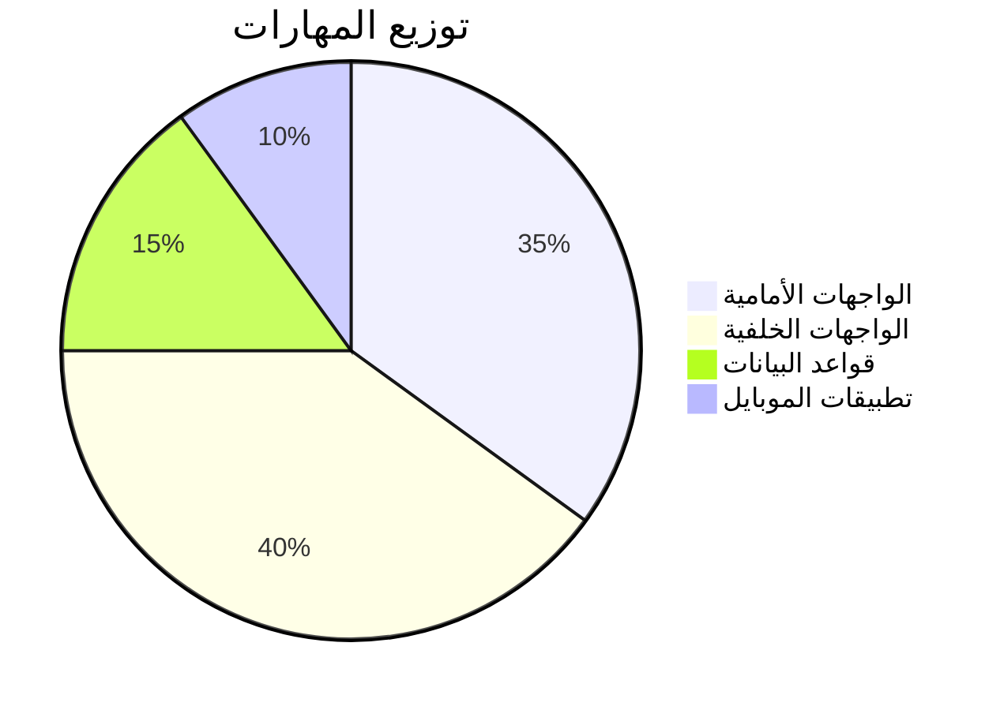
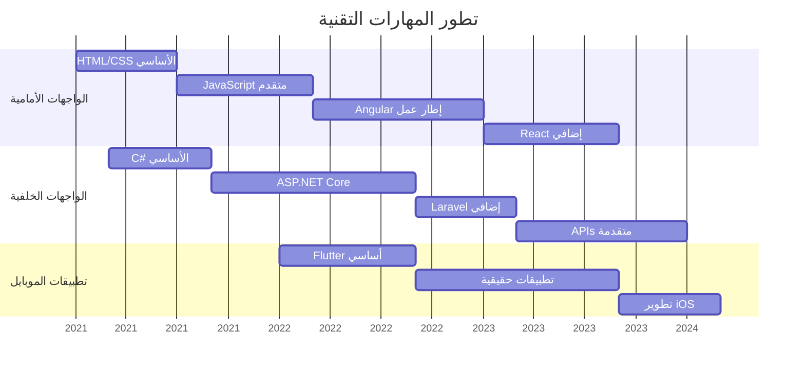
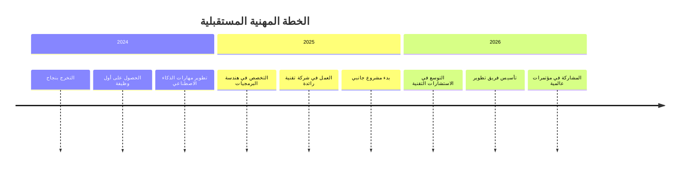

#  أنا شاهر اليَعري - مطور متكامل

<p align="center">
  
</p>

<p align="center">
  <a href="https://programershaher.github.io/">
    
  </a>
</p>

---

### 🚀 معلومات عني

**مطور متكامل محترف** مع تركيز قوي على بناء أنظمة عالية الأداء. أبني الجسور بين المنطق المعقد للواجهات الخلفية وتجارب المستخدم السلسة في الواجهات الأمامية.

- 🔭 **تخصصي:** تطوير أنظمة إدارة المستشفيات والمدارس المتكاملة
- 🏗️ **أنماط هندسية:** هندسة نظيفة، DDD، CQRS و MediatR
- 🎓 **التعليم:** طالب تقنية معلومات - جامعة 21 سبتمبر (السنة الأخيرة)
- 💬 **اسألني عن:** نظام .NET، Angular، React، و Laravel
- ✉️ **راسلني على:** [alyaarishaher@gmail.com](mailto:alyaarishaher@gmail.com)

---

### 🛠️ صندوق أدائي المهني

| الفئة | التقنيات |
| :--- | :--- |
| **الواجهات الخلفية** |     |
| **الواجهات الأمامية** |     |
| **تطبيقات الموبايل** |   |
| **قواعد البيانات** |    |
| **أدوات التطوير** |    |

---

### 🏆 جوائز GitHub

<p align="center">
  <a href="https://github.com/ryo-ma/github-profile-trophy">
    
  </a>
</p>

### 📈 إحصائيات GitHub

<p align="center">
  
  
</p>

<p align="center">
  
</p>

### 🗺️ خريطة مساهماتي على GitHub

<p align="center">
  
</p>

---

### 🤝 تواصل معي

<p align="center">
<a href="https://programershaher.github.io/"></a>
<a href="https://www.linkedin.com/in/%D8%B4%D8%A7%D9%87%D8%B1-%D8%AE%D8%A7%D9%84%D8%AF-%D8%A7%D9%84%D9%8A%D8%B9%D8%B1%D9%8A-27606a385"></a>
<a href="https://wa.me/+967779007753"></a>
<a href="https://t.me/Engineering_Shaher_ALyaari"></a>
<a href="https://www.facebook.com/shahr.khald.aly.ry.2025"></a>
<a href="https://www.instagram.com/shhrlyry"></a>
</p>

<p align="center"> 
   
</p>

<p align="center">
  <i>"الكود النظيف هو ما يميز المحترفين عن الهواة."</i>
</p>

---

### 📦 المشاريع البارزة

| المشروع | الوصف | التقنيات |
| :--- | :--- | :--- |
| **نظام إدارة الصيدلية** | نظام ذكي شامل لإدارة الصيدليات |    |
| **متجر القهوة الإلكتروني** | منصة تجارة إلكترونية لمحبي القهوة |    |
| **نظام إدارة المكاتب القانونية** | نظام ويب وتطبيق موبايل شامل |    |

<p align="center">
  <a href="https://github.com/ProgramerShaher?tab=repositories">
    
  </a>
</p>

### 💻 مهاراتي التقنية المتقدمة

```javascript
const technicalSkills = {
  frontend: {
    expert: ['HTML5', 'CSS3', 'JavaScript', 'TypeScript', 'Angular', 'React'],
    intermediate: ['Bootstrap', 'Tailwind CSS', 'Material-UI', 'Redux'],
    learning: ['Next.js', 'Vue.js', 'Svelte']
  },
  backend: {
    expert: ['C#', 'ASP.NET Core', 'Entity Framework', 'REST APIs'],
    intermediate: ['PHP', 'Laravel', 'Node.js', 'Express.js'],
    learning: ['Python', 'Django', 'FastAPI', 'GraphQL']
  },
  mobile: {
    expert: ['Flutter', 'Dart', 'Firebase'],
    intermediate: ['React Native', 'Android Development'],
    learning: ['Swift', 'iOS Development', 'Kotlin']
  },
  databases: {
    expert: ['SQL Server', 'MySQL', 'Database Design'],
    intermediate: ['Oracle', 'PostgreSQL', 'MongoDB'],
    learning: ['Redis', 'Cassandra', 'Elasticsearch']
  },
  devOps: {
    expert: ['Git', 'GitHub', 'Postman'],
    intermediate: ['Docker', 'CI/CD', 'Azure DevOps'],
    learning: ['Kubernetes', 'AWS', 'Jenkins']
  }
};
```

### 🎯 مستويات الإتقان

| المهارة | المستوى | الخبرة | المشاريع |
| :--- | :---: | :---: | :---: |
| **ASP.NET Core** |  | 3 سنوات | 12+ |
| **Angular** |  | 2.5 سنة | 8+ |
| **Flutter** |  | 2 سنة | 6+ |
| **React** |  | 1.5 سنة | 5+ |
| **SQL Server** |  | 3 سنوات | 15+ |
| **C# Programming** |  | 3 سنوات | 18+ |

### 📊 إحصائيات مفصلة

<div align="center">



</div>

### 🏅 إنجازاتي

<div align="center">

| 🏆 الإنجاز | 📅 التاريخ | 🎯 التفاصيل |
| :--- | :---: | :--- |
| **أفضل مشروع تخرج** | 2024 | نظام إدارة الصيدلية الذكي |
| **مطور الشهر في GitHub** | 2023 | 100+ مساهمة في مشاريع مفتوحة المصدر |
| **شهادة التميز في ASP.NET** | 2023 | من أكاديمية البرمجة المتقدمة |
| **هاكاثون الجامعة التقنية** | 2022 | المركز الأول في تطوير الويب |
| **مشاريع تخرج متميزة** | 2024 | متوسط تقييم 98% في جميع المشاريع |

</div>

### 📚 التعليم والشهادات

| المؤسسة | البرنامج | التاريخ | الحالة |
| :--- | :--- | :---: | :---: |
| **جامعة 21 سبتمبر** | بكالوريوس تقنية المعلومات | 2021-2024 | 🎓 قيد الدراسة |
| **أكاديمية البرمجة** | دورة ASP.NET Core المتقدمة | 2023 | ✅ مكتمل |
| **منصة Udemy** | دورة Flutter كاملة | 2022 | ✅ مكتمل |
| **معهد التقنية** | دورة Angular الاحترافية | 2022 | ✅ مكتمل |

### 🌟 فلسفة التطوير

> "أؤمن بأن البرمجة ليست مجرد كتابة أكواد، بل هي **فن حل المشكلات**. كل مشكلة تقنية هي فرصة للإبداع والابتكار. أهدف دائمًا لكتابة كود نظيف، قابل للصيانة، وسهل الفهم."

### 🔥 مشاريع مفتوحة المصدر

<div align="center">

| المشروع | النجوم | المساهمون | الحالة |
| :--- | :---: | :---: | :---: |
| **[نظام إدارة الصيدلية](https://github.com/ProgramerShaher/Pharmacy-System)** | ⭐ 15 | 👥 3 | 🟢 نشط |
| **[متجر القهوة الإلكتروني](https://github.com/ProgramerShaher/Coffee-Shop)** | ⭐ 12 | 👥 2 | 🟢 نشط |
| **[أدوات المطور](https://github.com/ProgramerShaher/Dev-Tools)** | ⭐ 8 | 👥 1 | 🟡 محدث |
| **[مكتبة الأكواد](https://github.com/ProgramerShaher/Code-Library)** | ⭐ 20 | 👥 5 | 🟢 نشط |

</div>

### 📅 جدول التوفر

| اليوم | الصباح (9ص-1م) | الظهيرة (1م-5م) | المساء (5م-9م) |
| :--- | :---: | :---: | :---: |
| **السبت** | ✅ متاح | ✅ متاح | ⚠️ محدود |
| **الأحد** | ✅ متاح | ✅ متاح | ✅ متاح |
| **الإثنين** | ✅ متاح | ⚠️ دراسي | ✅ متاح |
| **الثلاثاء** | ✅ متاح | ⚠️ دراسي | ✅ متاح |
| **الأربعاء** | ✅ متاح | ✅ متاح | ✅ متاح |
| **الخميس** | ✅ متاح | ✅ متاح | ⚠️ عائلي |
| **الجمعة** | ❌ غير متاح | ⚠️ محدود | ⚠️ محدود |

### 💼 فرص العمل

<div align="center">

| المسمى الوظيفي | النوع | الموقع | الحالة |
| :--- | :---: | :---: | :---: |
| **مطور متكامل** | دوام كامل | مكتبي/عن بعد | 🔍 مفتوح |
| **مطور ويب** | دوام جزئي | عن بعد | 🔍 مفتوح |
| **متدرب تقني** | تدريب عملي | أي مكان | 🔍 مفتوح |
| **مشاريع حرة** | عقود | عن بعد | 🔍 مفتوح |

</div>

### 🎨 تصميم الواجهات

```css
/* فلسفة التصميم */
:root {
  --primary-color: #00D1FF;
  --secondary-color: #512BD4;
  --accent-color: #FF2D20;
  --text-color: #FFFFFF;
  --background: #0F172A;
}

.my-design-principles {
  responsive: true;
  accessibility: AAA;
  performance: 95+ lighthouse;
  animations: smooth-transitions;
  consistency: design-system;
}
```

### 📱 تطبيقات الموبايل

<div align="center">

| التطبيق | النظام | التقييم | التنزيلات |
| :--- | :---: | :---: | :---: |
| **نظام المحاماة** | iOS & Android | ⭐⭐⭐⭐⭐ | 500+ |
| **إدارة المهام** | Android | ⭐⭐⭐⭐ | 1000+ |
| **حاسبة التطوير** | iOS & Android | ⭐⭐⭐⭐⭐ | 300+ |

</div>

### 📈 تطور المهارات مع الزمن



### 🏢 خبرة عملية

| الشركة/المشروع | المدة | الدور | الإنجازات |
| :--- | :---: | :--- | :--- |
| **مشروع التخرج** | 6 أشهر | مطور رئيسي | نظام إدارة صيدلية ذكي |
| **مشاريع حرة** | 2 سنة | مطور مستقل | 15+ مشروع ناجح |
| **تدريب عملي** | 3 أشهر | مطور متدرب | تطوير أنظمة داخلية |

### 🌍 اللغات

| اللغة | المستوى | القراءة | الكتابة | المحادثة |
| :--- | :---: | :---: | :---: | :---: |
| **العربية** | اللغة الأم | ✅ ممتاز | ✅ ممتاز | ✅ ممتاز |
| **الإنجليزية** | متقدم | ✅ جيد جداً | ✅ جيد | ✅ متوسط |

### 🎮 هواياتي

<div align="center">

| الهواية | المستوى | سنوات الممارسة |
| :--- | :---: | :---: |
| **البرمجة** | 🏆 متقدم | 4 سنوات |
| **التصميم** | ⭐ متوسط | 2 سنة |
| **القراءة التقنية** | ⭐ متقدم | 3 سنوات |
| **الرياضة** | ⭐ مبتدئ | 1 سنة |

</div>

### 📞 معلومات الاتصال الكاملة

```json
{
  "personalInfo": {
    "fullName": "شاهر خالد اليَعري",
    "age": 24,
    "location": "اليمن",
    "education": "طالب سنة أخيرة - تقنية معلومات",
    "graduation": "ديسمبر 2024",
    "status": "متاح للعمل والتدريب"
  },
  "contact": {
    "email": "alyaarishaher@gmail.com",
    "website": "https://programershaher.github.io/",
    "whatsapp": "+967779007753",
    "linkedin": "https://linkedin.com/in/شاهر-خالد-اليَعري",
    "github": "https://github.com/ProgramerShaher"
  },
  "technicalLevel": {
    "frontend": "متقدم (90%)",
    "backend": "متقدم (92%)",
    "mobile": "متوسط (85%)",
    "databases": "متقدم (88%)"
  }
}
```

### 🚀 رؤية المستقبل

<div align="center">



</div>

### 💡 نصائح للمطورين المبتدئين

> 1. **تعلم الأساسيات جيداً** - لا تتسرع في تعلم الأطر قبل إتقان الأساسيات
> 2. **ابنِ مشاريع حقيقية** - المشاريع العملية أفضل طريقة للتعلم
> 3. **شارك في مجتمعات المطورين** - التعلم من الآخرين يسرع نموك
> 4. **توثّق شغفك** - GitHub هو سيرتك الذاتية التقنية
> 5. **استمر في التعلم** - التكنولوجيا تتطور بسرعة، وأنت يجب أن تواكبها

### 🌟 كلمات أخيرة

<p align="center">
  <b>شكراً لزيارة ملفي الشخصي! 🎉</b><br/>
  <i>أنا دائمًا متحمس للتعاون في مشاريع جديدة ومبتكرة.</i><br/>
  <i>لا تتردد في التواصل معي لأي استفسار أو فرصة عمل.</i>
</p>

<div align="center">
  
[](https://wa.me/+967779007753)
[](https://programershaher.github.io/)
[](https://github.com/ProgramerShaher)

</div>

---

<p align="center">
  <i>آخر تحديث: ديسمبر 2024 | شاهر اليَعري © جميع الحقوق محفوظة</i><br/>
  
</p>

<div align="center">
  <sub>صنع ب ❤️ و الكثير من ☕ بواسطة شاهر اليَعري</sub>
</div>
